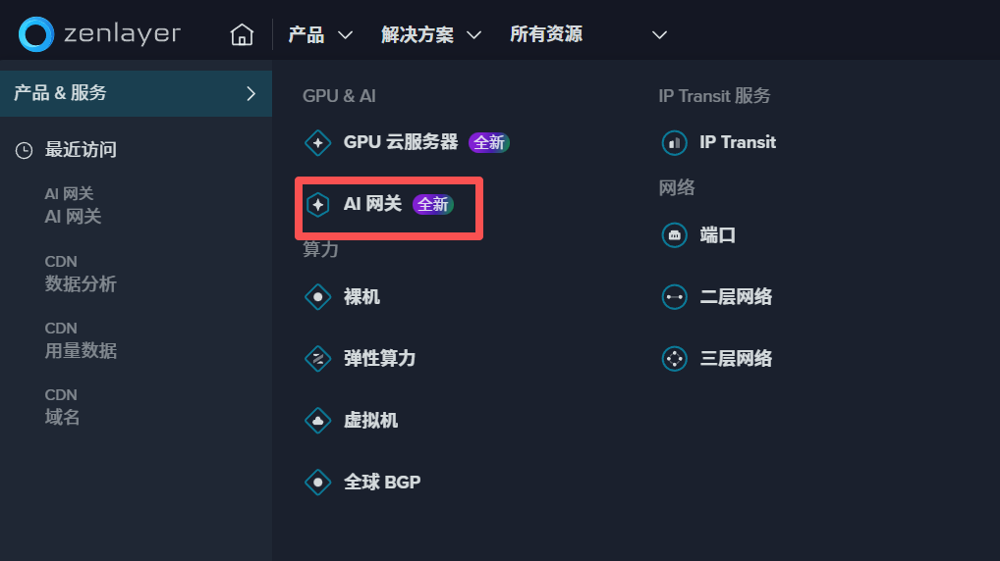
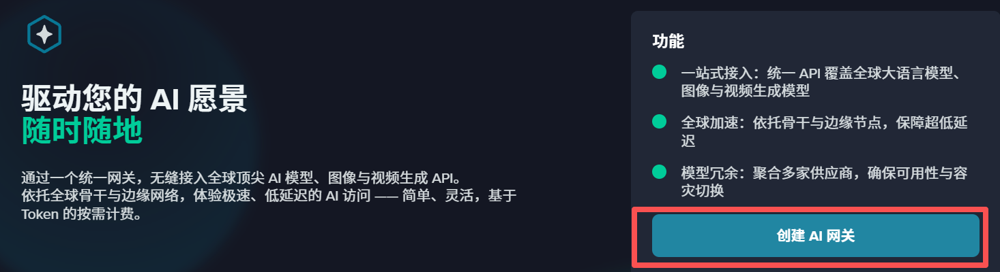
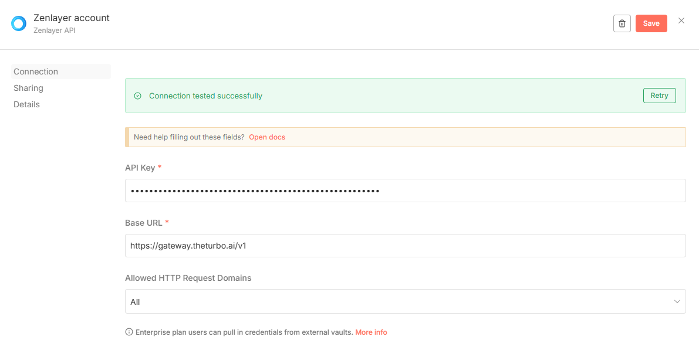

# 介绍
Zenlayer AI Gateway提供全球领先的 AI 大模型推理服务，依托 Zenlayer 的全球私有网络与分布式边缘架构，为用户带来超低时延、高可靠性的使用体验。平台支持多种主流与前沿 AI 模型，覆盖文本、图像、音频、视频等多模态任务，并集成了业界最受欢迎的模型生态。开发者无需深入理解底层机器学习或基础设施架构，即可轻松使用最先进的 AI 能力，快速构建智能化应用。

## 创建 Zenlayer 账户并获取 API Key
1.前往 ZenlayerAI 控制台创建并管理 API Key (入口见 https://console.zenlayer.com/aigw/aigateway).

2.点击 [产品]-[创建AI网关]

3.点击 [创建AI网关] 生成新的API Key

4.请注意：API Key 只会在生成时展示一次。请务必复制并妥善保存，以确保未来能够持续使用

5.在 n8n 中配置 Zenlayer AI Gateway 节点，填写 API Key 以完成集成。

## 主要功能
### 全球加速的模型访问能力
基于 Zenlayer 的全球私有网络，在全球范围内提供低延迟的模型推理服务，无论用户身在何处都能获得一致稳定的体验。

### 丰富的 AI 模型生态
- 支持多领域多模态 AI 模型，包括但不限于：
- 大语言模型（LLM）
- 文本生成与文本理解
- 图像、音频、视频生成与处理模型

### 分布式边缘推理加速
依托 Zenlayer 的边缘节点网络，实现更快的响应速度与更高吞吐能力，为实时性（如对话、音视频处理）场景提供强劲支持。

### 开发者友好与易集成
只需简单的 API 调用即可接入，无需复杂部署；灵活的配置可满足不同规模应用的接入需求。

### 高性价比的 AI 推理服务
提供灵活的计费方式，适用于创业团队、中小企业乃至大型分布式应用，确保成本可控且性能卓越。